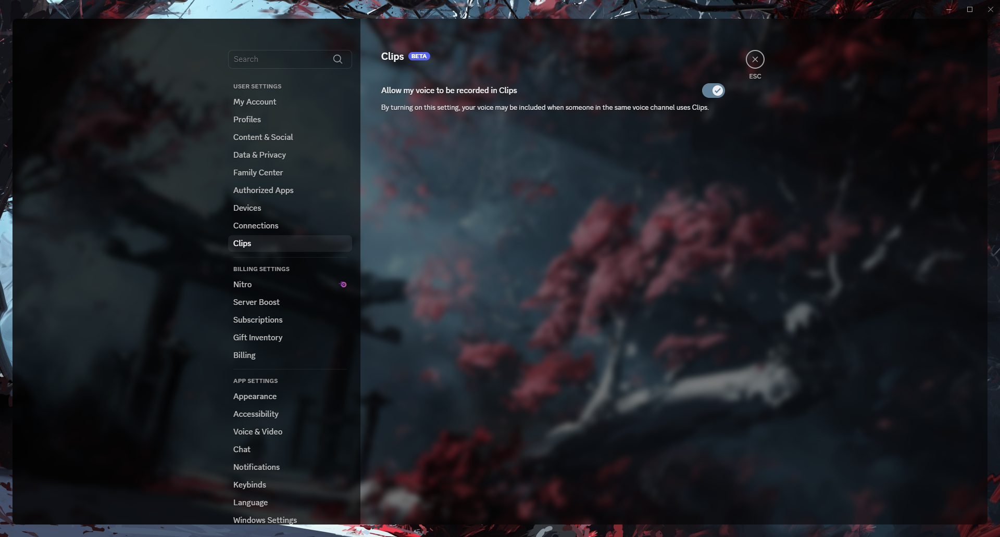

# ClearDark +
#### Translucent Clear Dark Glass Discord theme

## Current version: v1.4.2 (08/03/2025)

**Changelog** : [Changelog v1.4.2](https://fo-lighty.github.io/ClearDark-Plus/changelog)

#### **CSS link**
```
https://fo-lighty.github.io/ClearDark-Plus/css/source.css
```

## Preview

#### Main chat area


#### User server info


#### User info popout


#### User settings



#### DMs


## About

This is the first Discord theme I ever worked on!
Its purpose is essentially to create a light translucent black background and add an image to make it more personal!

### Installation
Installation of BetterDiscord :
- Download the installer on the official website (https://betterdiscord.app)
- Open the installer (*BetterDiscord.exe*)
- Follow the instruction and done!


Installing betterdiscord themes is really easy!
- Go into discord's settings
- Go to "*Themes*"
- Click on "*Open theme folder*"
- Move the *.theme.css* file you downloaded into the folder you just opened
- Click the checkbox in the top-right corner of the theme in discord to enable it

## Variables

#### App Elements:
 - `--app-bg` - The **background image** for the entire app. Default: `url(https://fo-lighty.github.io/ClearDark-Plus/assets/images/Samurai.jpg)`
 - `--app-blur` - The **blur intensity** applied to the background image. Default: `6px`
 - `--app-margin` - The **margin** around the main interface panels. Default: `24px`
 - `--app-radius` - The **corner radius** for the main elements. Default: `10px`
 - `--main-rgb` - The **base RGB color** used for backgrounds. Default: `0,0,0`
 - `--main-content-opacity` - The **background opacity** for the main content area. Default: `0.515`
 - `--sidebar-opacity` - The **background opacity** for the sidebar. Default: `0.8`

#### Accent Color:
 - `--accent-hue` - The **hue** for the main accent color. Default: `206`
 - `--accent-saturation` - The **saturation** for the main accent color. Default: `22%`
 - `--accent-lightness` - The **lightness** for the main accent color. Default: `49%`
 - `--accent-hsl` - Combines the HSL values to create the final accent color; not meant to be changed directly. Default: `var(--accent-hue),calc(var(--accent-saturation) * var(--saturation-factor)),var(--accent-lightness)`
 - `--accent-opacity` - The **opacity** for elements using the accent color. Default: `1`
 - `--accent-text-color` - The **text color** for elements with an accent color background. Default: `hsl(216,17%,94%)`
 - `--accent-secondary-color` - A more subtle, secondary accent color. Default: `hsl(from hsl(var(--accent-hsl)) h calc(s * 0.1) l / 0.35)`
 - `--accent-secondary-text-color` - The text color for elements using the secondary accent color. Default: `hsl(0,0%,94%)`
 - `--accent-hsl-darker` - A **darker shade** used within the theme's accent palette. Default: `hsl(210, 21%, 13%)`
 - `--accent-hsl-even-darker` - An **even darker shade** used within the theme's accent palette. Default: `hsl(210, 21%, 5%)`

#### Alert:
 - `--alert-hue` - The **hue** for alert messages. Default: `359`
 - `--alert-saturation` - The **saturation** for alert messages. Default: `66.7%`
 - `--alert-lightness` - The **lightness** for alert messages. Default: `54.1%`
 - `--alert-opacity` - The **opacity** for alert messages. Default: `1`
 - `--alert-action-color` - The **color** for alert actions. Default: `hsl(0,0%,100%)`
 - `--alert-text-color` - The **color** for alert text. Default: `hsl(0,0%,100%)`

#### Messages:
 - `--message-color` - The **color** for messages. Default: `hsl(0,0%,0%,0.51)`
 - `--message-color-hover` - The **color** for messages when hovered. Default: `hsl(0,0%,0%,0.55)`
 - `--message-radius` - The **border-radius** for messages. Default: `8px`
 - `--message-padding-top` - The **top padding** for messages. Default: `8px`
 - `--message-padding-side` - The **side padding** for messages. Default: `8px`
 - `--mention-hue` - The **hue** value for the message mention color. Default: `156`
 - `--mention-saturation` - The **saturation** value for the message mention color. Default: `77.5%`
 - `--mention-lightness` - The **lightness** value for the message mention color. Default: `47.1%`
 - `--mention-opacity` - The **opacity** of the message mention color. Default: `1`
 - `--reply-hue` - The **hue** for reply messages. Default: `210`
 - `--reply-saturation` - The **saturation** for reply messages. Default: `20%`
 - `--reply-lightness` - The **lightness** for reply messages. Default: `39%`
 - `--reply-opacity` - The **opacity** for reply messages. Default: `1`

#### Textareas and Inputs:
 - `--textarea-color` - The **base RGB color** for the text area. Default: `255,255,255`
 - `--textarea-alpha` - The **alpha (opacity) value** for the text area when not focused. Default: `0.1`
 - `--textarea-alpha-focus` - The **alpha (opacity) value** for the text area when focused. Default: `0.15`
 - `--textarea-text-color` - The **color** of the text within the text area. Default: `hsl(0,0%,100%)`
 - `--textarea-placeholder-color` - The **color** of the placeholder text within the text area. Default: `hsl(0,0%,90%)`
 - `--textarea-radius` - The **border-radius** for the text area. Default: `28px`
 - `--textarea-block-color` - The **background color** for blocked text areas. Default: `hsl(0,0%,0%,0.4)`
 - `--textarea-block-text-color` - The **text color** for blocked text areas. Default: `#ccc`
 - `--input-height` - The **height** of input fields. Default: `36px`

#### Cards:
 - `--card-color` - The **background color** for cards. Default: `hsl(0,0%,0%,0.4)`
 - `--card-color-hover` - The **background color** for cards when hovered. Default: `hsl(0,0%,0%,0.5)`
 - `--card-color-select` - The **background color** for selected cards. Default: `hsl(0,0%,0%,0.625)`
 - `--card-header-shadow` - The **box shadow** for card headers. Default: `0px 3px 9px 0px hsl(0,0%,0%,0.25)`

#### Buttons:
 - `--button-height` - The **height** of buttons. Default: `32px`
 - `--button-padding` - The **padding** for buttons (top/bottom and left/right). Default: `0 16px`
 - `--button-color` - The **background color** of buttons, derived from `--accent-hsl` and `--accent-opacity`. Default: `hsla(var(--accent-hsl),var(--accent-opacity))`
 - `--button-action-color` - The **color** of button actions (e.g., icons). Default: `hsl(0,0%,0%)`
 - `--button-radius` - The **border-radius** for buttons. Default: `16px`

#### Switch Settings:
 - `--switch-slider-color` - The **color** of the switch slider. Default: `hsla(218,4.6%,46.9%,0.85)`
 - `--switch-knob-color` - The **color** of the switch knob. Default: `hsl(0,0%,13%)`

#### Popouts and Modals:
 - `--popout-color` - The **background color** for popout elements. Default: `hsl(0,0%,0%,0.55)`
 - `--popout-blur` - The **blur effect** applied to popout elements. Default: `8px`
 - `--popout-header-opacity` - The **opacity** of popout headers. Default: `0.3`
 - `--popout-header-shadow` - The **box shadow** for popout headers. Default: `0px 3px 9px 0px hsl(0,0%,0%,0.25)`
 - `--popout-shadow` - The **box shadow** for popout elements. Default: `0 8px 10px 1px hsl(0,0%,0%,0.14), 0 3px 14px 2px hsl(0,0%,0%,0.12), 0 5px 5px -3px hsl(0,0%,0%,0.2)`
 - `--nowplaying-color` - The **RGB color** for "now playing" indicators. Default: `88,101,242`
 - `--streaming-color` - The **RGB color** for streaming indicators. Default: `89,54,149`
 - `--spotify-color` - The **RGB color** associated with Spotify. Default: `29,185,84`
 - `--server-folder-color` - The **background color** for server folders. Default: `hsl(0,0%,100%,0.1)`

#### Scrollbar Settings
 - `--scrollbar-color` - The **RGB color** for the scrollbar thumb. Default: `255,255,255`
 - `--scrollbar-color-alt` - The **alternate RGB color** for the scrollbar track or background. Default: `0,0,0`
 - `--scrollbar-opacity` - The **opacity** of the scrollbar when not hovered. Default: `0.2`
 - `--scrollbar-opacity-hover` - The **opacity** of the scrollbar when hovered. Default: `0.3`
 - `--scrollbar-width` - The **width** of the scrollbar. Default: `10px`
