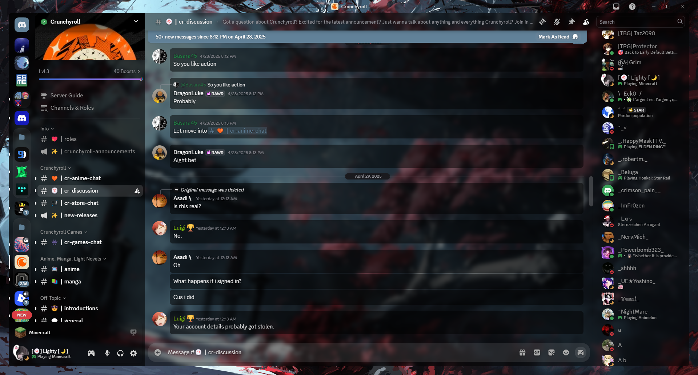
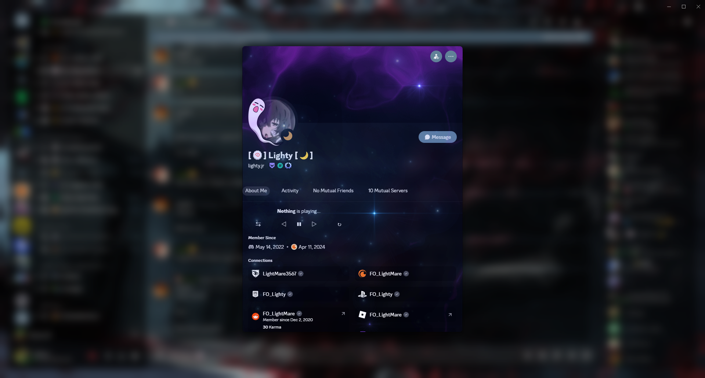

# ClearDark +
#### Translucent anime character / Clear Dark Glass Discord theme

## Current version: v1.3.1 (05/05/2025)

**Changelog** : [Changelog v1.3.1](https://fo-lighty.github.io/ClearDark-Plus/changelog)

#### **CSS link**
```
https://fo-lighty.github.io/ClearDark-Plus/css/source.css
```

## Preview

#### Main chat area



#### User server info


#### User info popout



#### User settings


#### DMs


## About

This is the first Discord theme I ever worked on!
Its purpose is essentially to create a light translucent black background and add an image to make it more personal!

### Installation
Installation of BetterDiscord :
- Download the installer on the official website (https://betterdiscord.app)
- Open the installer (*BetterDiscord.exe*)
- Follow the instruction and done!


Installing betterdiscord themes is really easy!
- Go into discord's settings
- Go to "*Themes*"
- Click on "*Open theme folder*"
- Move the *.theme.css* file you downloaded into the folder you just opened
- Click the checkbox in the top-right corner of the theme in discord to enable it

## Variables

#### App elements:
 - `--app-bg` - The background image for the entire app. Default: `url(https://fo-lighty.github.io/ClearDark-Plus/assets/images/Samurai.jpg)`
 - `--app-blur` - The blur intensity applied to the background image. Default: `6px`
 - `--app-margin` - The margin around the main interface panels. Default: `24px`
 - `--app-radius` - The corner radius for the main elements. Default: `10px`
 - `--main-rgb` - The base RGB color used for backgrounds. Default: `0,0,0`
 - `--main-content-opacity` - The background opacity for the main content area. Default: `0.515`
 - `--sidebar-opacity` - The background opacity for the sidebar. Default: `0.8`
 - `--main-content-color` - The final color for the main content area (combines `--main-rgb` and `--main-content-opacity`). Default: `rgba(var(--main-rgb), var(--main-content-opacity))`
 - `--sidebar-color` - The final color for the sidebar (combines `--main-rgb` and `--sidebar-opacity`). Default: `rgba(var(--main-rgb), var(--sidebar-opacity))`

#### Accent color:
 - `--accent-hue` - The **hue** for the main accent color. Default: `206`
 - `--accent-saturation` - The **saturation** for the main accent color. Default: `22%`
 - `--accent-lightness` - The **lightness** for the main accent color. Default: `49%`
 - `--accent-hsl` - Combines the HSL values to create the final accent color; not meant to be changed directly. Default: `var(...)`
 - `--accent-opacity` - The **opacity** for elements using the accent color. Default: `1`
 - `--accent-text-color` - The **text color** for elements with an accent color background. Default: `hsl(216,17%,94%)`
 - `--accent-secondary-color` - A more subtle, secondary accent color. Default: `hsl(...)`
 - `--accent-secondary-text-color` - The text color for elements using the secondary accent color. Default: `hsl(0,0%,94%)`
 - `--accent-hsl-darker` - A **darker shade** used within the theme's accent palette. Default: `hsl(210, 21%, 13%)`
 - `--accent-hsl-even-darker` - An **even darker shade** used within the theme's accent palette. Default: `hsl(210, 21%, 5%)`

#### Alert:
 - `--alert-hue` - The **hue** for alert messages. Default: `359`
 - `--alert-saturation` - The **saturation** for alert messages. Default: `66.7%`
 - `--alert-lightness` - The **lightness** for alert messages. Default: `54.1%`
 - `--alert-opacity` - The **opacity** for alert messages. Default: `1`
 - `--alert-action-color` - The **color** for alert actions. Default: `hsl(0,0%,100%)`
 - `--alert-text-color` - The **color** for alert text. Default: `hsl(0,0%,100%)`

#### Messages:
 - `--message-color` - The **color** for messages. Default: `hsl(0,0%,0%,0.51)`
 - `--message-color-hover` - The **color** for messages when hovered. Default: `hsl(0,0%,0%,0.55)`
 - `--message-radius` - The **border-radius** for messages. Default: `8px`
 - `--message-padding-top` - The **top padding** for messages. Default: `8px`
 - `--message-padding-side` - The **side padding** for messages. Default: `8px`
 - `--mention-hue` - The **hue** value for the message mention color. Default: `156`
 - `--mention-saturation` - The **saturation** value for the message mention color. Default: `77.5%`
 - `--mention-lightness` - The **lightness** value for the message mention color. Default: `47.1%`
 - `--mention-opacity` - The **opacity** of the message mention color. Default: `1`
 - `--reply-hue` - The **hue** for reply messages. Default: `210`
 - `--reply-saturation` - The **saturation** for reply messages. Default: `20%`
 - `--reply-lightness` - The **lightness** for reply messages. Default: `39%`
 - `--reply-opacity` - The **opacity** for reply messages. Default: `1`

#### Textareas and inputs:
 - `--textarea-color` - The background color for any textareas and inputs. Default: `255,255,255`
 - `--textarea-alpha` - The opacity for any textareas and inputs. Default: `0.15`
 - `--textarea-text-color` - The text color for textareas and inputs. Default: `hsl(0, 100%, 100%)`
 - `--textarea-radius` - The border radius for textareas (not inputs). Default: `22px`
 - `--input-height` - The height for inputs. Default: `36px`
 - `--input-radius` - The border radius for inputs (not textareas). Default: `18px`

#### Cards:
 - `--card-color` - The background color for cards. Default: `hsl(0,0%,0%,0.4)`
 - `--card-color-hover` - The background color for hovering over cards (if there is a hover animation). Default: `hsl(0,0%,0%,0.5)`
 - `--card-color-select` The background color for the selected cards. Default: `hsl(0,0%,0%,0.7)`
 - `--card-radius` - The border radius for cards. Default: `8px`

#### Buttons:
 - `--button-height` - The height for buttons. Default: `32px`
 - `--button-padding` - The padding for buttons. Default: `0 16px`
 - `--button-color` - The background color for most buttons. Default: `#d73d3d`
 - `--button-action-color` - The background color for hovering and clicking on buttons (has a lowered opacity). Default: `hsl(0,0%,0%)`
 - `--button-text-color` - The text color for any buttons that use `--button-color`. Default: `#000`
 - `--button-radius` - The border radius for buttons. Default: `16px`

#### Popouts and modals:
 - `--popout-color` - The background color for modals/popouts. Default: `rgba(0,0,0, 0.55)`
 - `--popout-blur` - The blur strength for modals/popouts. Default: `5px`
 - `--popout-header-opacity` - The header opacity for modals/popouts. Default: `0.3`
 - `--popout-header-shadow`- The shadow for headers in modals/popouts. Default: `0px 3px 9px 0px rgba(0,0,0, 0.25)`
 - `--popout-radius` - The border radius for modals/popouts. Default: `8px`
 - `--popout-shadow` - The shadow for modals/popouts. Default: `0 8px 10px 1px rgba(0,0,0, 0.14)`
