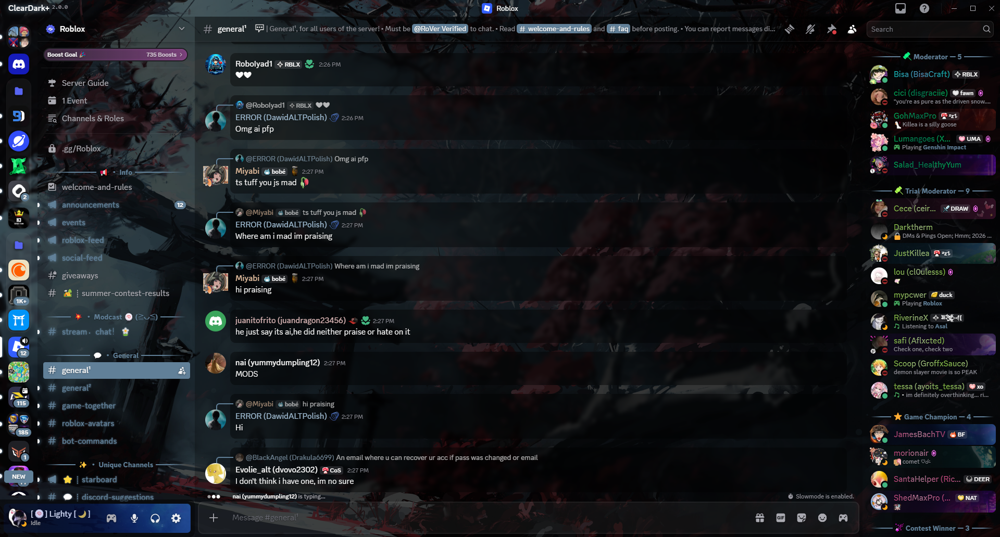
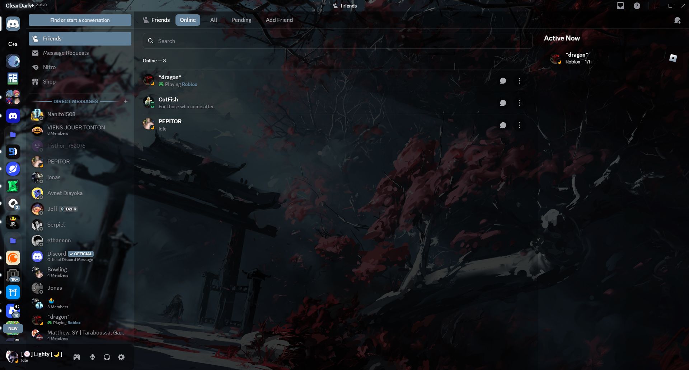
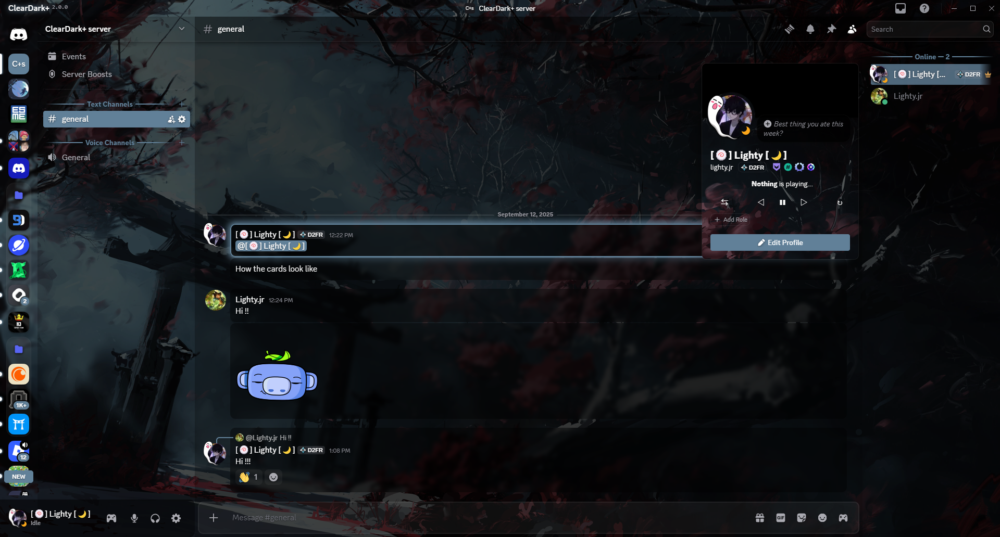
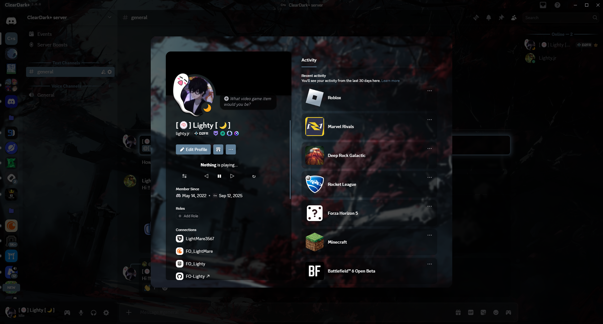
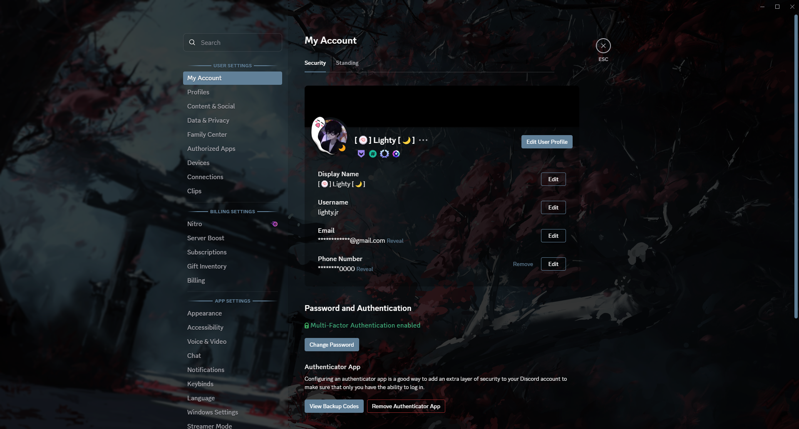
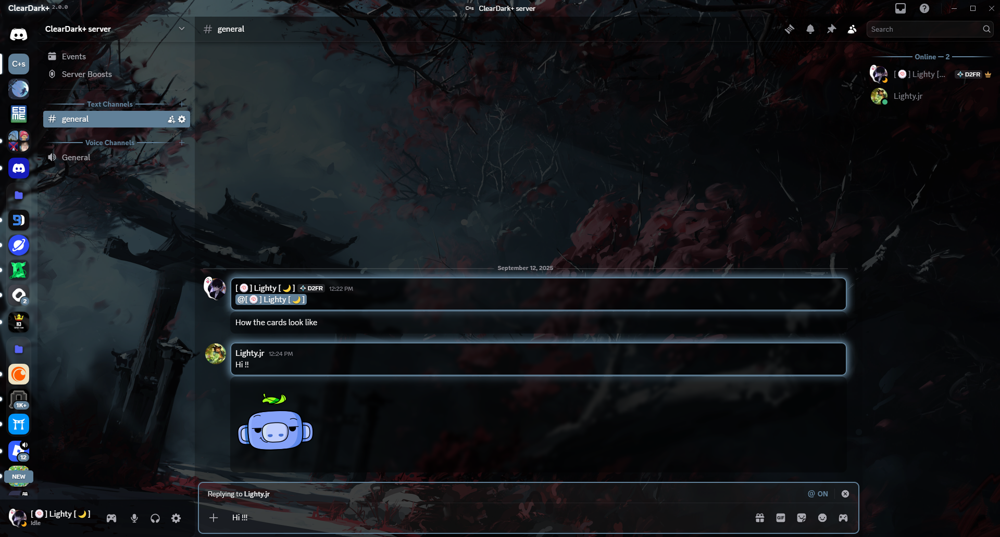

# ClearDark+ v2
#### **V2 has Arrived! The Translucent Dark Glass Theme You've Been Waiting For!**

<br/>

## New version : ClearDark+ v2.3.2
Discord gets a sleek, luminous upgrade with the Translucent Dark Glass V2! It's clear, dark, and full of life, creating a modern and cheerful space for all your chats.

* Check out the changelog : [Changelog v2.3.2](https://fo-lighty.github.io/ClearDark-Plus/changelog)

#### **CSS link**

The updated source code ```main.css``` :

```
https://fo-lighty.github.io/ClearDark-Plus/css/main.css
```

<br/>

## Preview

Take a peek at these previews of the theme! These images will give you a glimpse into its unique style:

#### Main chat area



#### User's friends



#### User server info



#### User info popout



#### User settings



#### DMs


#### Cards



<br/>

## About

I created this theme to share my knowledge and skills with everyone.<br/>
<br/>
Accessible, practical, and customizable are my guiding principles for this V2 of the project. A contrast adaptation has been made to meet the needs of some users (yes, I did this for you, those who use Discord's light theme).

### Installation
Installation of BetterDiscord :
- Download the installer on the official website (https://betterdiscord.app)
- Open the installer (*BetterDiscord.exe*)
- Follow the instruction and done!


Installing betterdiscord themes is really easy!
- Go into discord's settings
- Go to "*Themes*"
- Click on "*Open theme folder*"
- Move the ```.theme.css``` file you downloaded into the folder you just opened
- Click the checkbox in the top-right corner of the theme in discord to enable it

<br/>

## Variables

### Accent Colors
- `--main-color` - The **main accent color** (hex, rgb or hsl). Default: `#618098`
- `--hover-color` - The **hover accent color** (hex, rgb or hsl). Default: `#8199ad`
- `--success-color` - The **positive accent color** (hex, rgb or hsl). Default: `#43b581`
- `--danger-color` - The **danger accent color** (hex, rgb or hsl). Default: `#982929`
- `--accent-text-color` - The **accent text color** (hex, rgb or hsl). Default: `hsl(216,17%,94%)`

### Status Colors
- `--online-color` - The **online status color** (hex, rgb or hsl). Default: `#43b581`
- `--idle-color` - The **idle status color** (hex, rgb or hsl). Default: `#faa61a`
- `--dnd-color` - The **Do Not Disturb status color** (hex, rgb or hsl). Default: `#982929`
- `--streaming-color` - The **streaming status color** (hex, rgb or hsl). Default: `#593695`
- `--offline-color` - The **offline/invisible status color** (hex, rgb or hsl). Default: `#808080`

### App Background
- `--background-shading-percent` - The **app background shading amount** (0 for complete smoothness). Default: `100%`
- `--background-image` - The **app background image** (link must be HTTPS). Default: `url(https://fo-lighty.github.io/ClearDark-Plus/assets/images/Samurai.jpeg)`
- `--background-position` - The **app background position**. Default: `center`
- `--background-size` - The **app background size** (px). Default: `cover`
- `--background-attachment` - The **app background attachment**. Default: `fixed`
- `--background-filter` - The **app background adjustments** (ex: blur, saturation, brightness). Default: `saturate(calc(var(--saturation-factor, 1) * 1))`
- `--background-modifier-hover` - The **background modifier** for hover effects. Default: `hsl(0,0%,100%,0.075)`
- `--background-modifier-active` - The **background modifier** for active effects. Default: `hsl(0,0%,100%,0.1)`
- `--background-modifier-selected` - The **background modifier** for selected elements. Default: `hsl(0,0%,100%,0.125)`
- `--background-modifier-accent` - The **background modifier** for accent elements. Default: `hsl(0,0%,100%,0.175)`

### User Popout Background
- `--user-popout-image` - The **user popout background image** (link must be HTTPS) (not applied to nitro users). Default: `var(--background-image)`
- `--user-popout-position` - The **user popout position**. Default: `var(--background-position)`
- `--user-popout-size` - The **user popout size** (px). Default: `var(--background-size)`
- `--user-popout-attachment` - The **user popout background attachment**. Default: `var(--background-attachment)`
- `--user-popout-filter` - The **user popout background adjustments** (ex: blur, saturation, brightness). Default: `var(--background-filter)`

### Reply HSL Color Settings
- `--reply-accent` - The **reply accent color** (hex, rgb or hsl). Default: `#738292`

### Card Settings
- `--card-color` - The **background color of the cards**. Default: `hsl(0,0%,0%,0.4)`
- `--card-color-hover` - The **background color of the cards when hovered**. Default: `hsl(0,0%,0%,0.5)`
- `--card-color-select` - The **background color of the cards when selected**. Default: `hsl(0,0%,0%,0.625)`
- `--card-radius` - The **border radius of the cards**. Default: `10px`
- `--card-header-shadow` - The **box-shadow for the card header**. Default: `0px 3px 9px 0px hsl(0,0%,0%,0.25)`

### Mention HSL Color Settings
- `--mention-color` - The **mention color**. Default: `var(--main-color)`
- `--mention-opacity` - The **opacity of the mention color**. Default: `1`

### Message Color Settings
- `--message-color` - The **background color of a message**. Default: `hsl(0,0%,0%,0.4)`
- `--message-color-hover` - The **background color of a message when hovered**. Default: `hsl(0,0%,0%,0.55)`
- `--message-radius` - The **border-radius of the messages**. Default: `10px`
- `--message-padding-top` - The **top padding of the messages**. Default: `8px`
- `--message-padding-side` - The **side padding of the messages**. Default: `8px`

### User Modal Background
- `--user-modal-image` - The **user modal background image** (link must be HTTPS) (not applied to Nitro users). Default: `var(--background-image)`
- `--user-modal-position` - The **user modal position**. Default: `var(--background-position)`
- `--user-modal-size` - The **user modal size** (px). Default: `var(--background-size)`
- `--user-modal-attachment` - The **user modal background attachment**. Default: `var(--background-attachment)`
- `--user-modal-filter` - The **user modal background adjustments** (ex: blur, saturation, brightness). Default: `var(--background-filter)`

### Home Icon
- `--home-icon` - The **home button icon** (link must be HTTPS). Default: `url(https://fo-lighty.github.io/ClearDark-Plus/assets/icons/discord.svg)`
- `--home-size` - The **home button icon size** (px). Default: `cover`

### Fonts
- `--main-font` - The **main font** for the app (font must be installed). Default: `"gg sans", "Helvetica Neue", Helvetica, Arial, sans-serif`
- `--code-font` - The **font** for codeblocks (font must be installed). Default: `Consolas, "gg mono", "Liberation Mono", Menlo, Courier, monospace`

### Channel Colors
- `--channel-normal` - The **channel text color**. Default: `var(--interactive-normal)`
- `--channel-muted` - The **muted channel text color**. Default: `var(--interactive-muted)`
- `--channel-hover` - The **hovered channel text color**. Default: `var(--interactive-hover)`
- `--channel-selected` - The **selected channel text color**. Default: `var(--interactive-active)`
- `--channel-selected-bg` - The **selected channel background**. Default: `var(--main-color)`
- `--channel-unread` - The **unread channel text color**. Default: `var(--main-color)`
- `--channel-unread-hover` - The **unread channel hover color**. Default: `var(--hover-color)`

### Accessibility
- `--focus-color` - The **outline** when pressing the TAB key. Default: `var(--main-color)`
